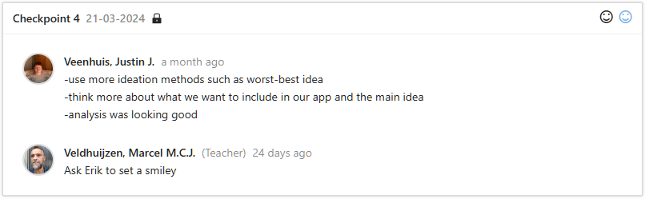
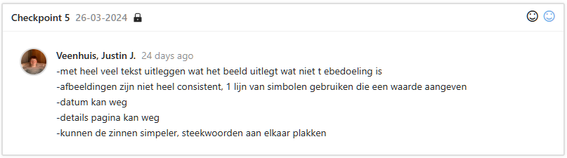
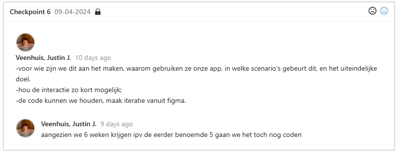
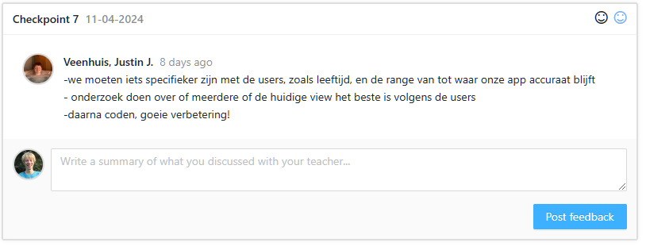
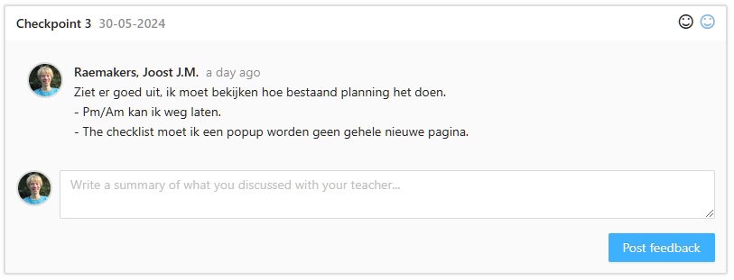
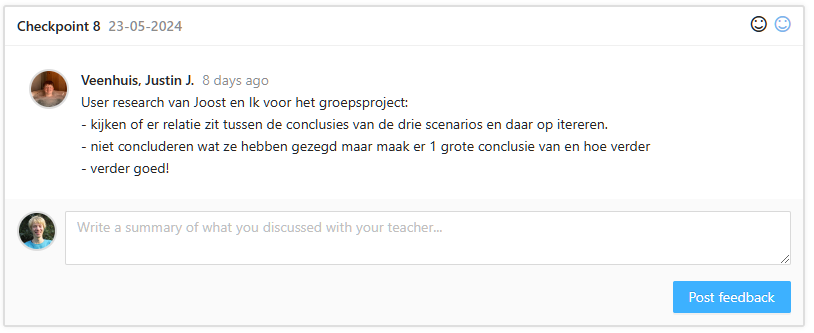
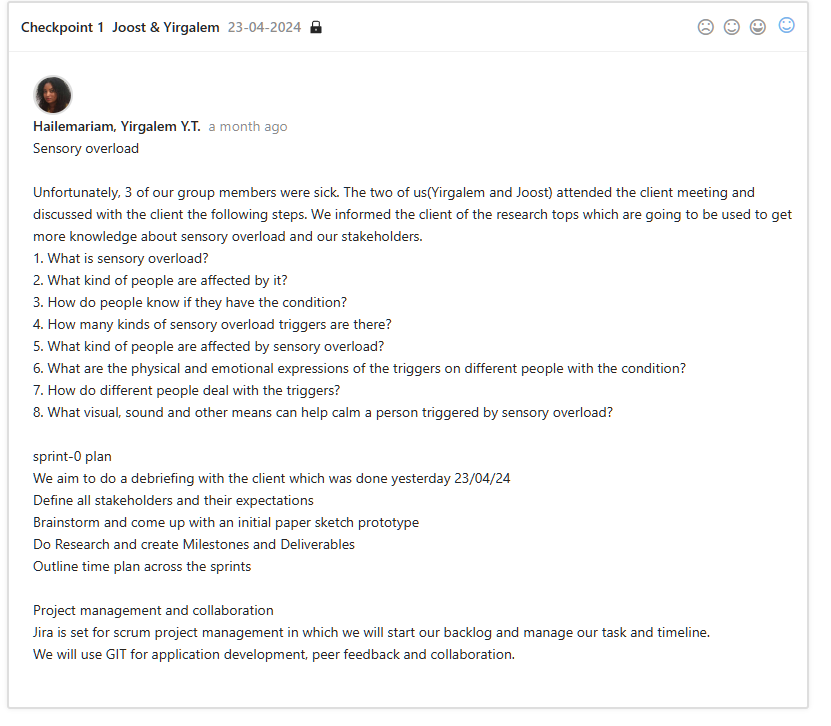
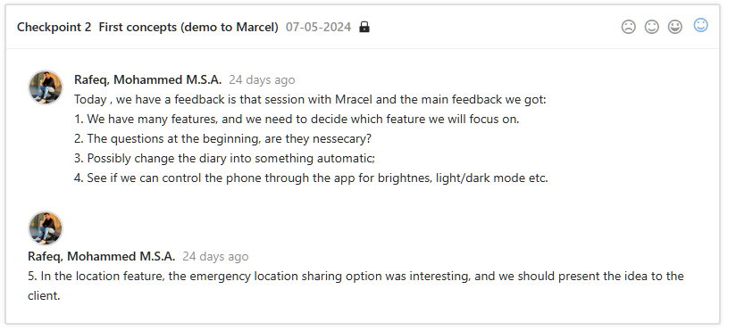

# Advice

- [Advice](#advice)
  - [Week 1 - 3](#week-1---3)
  - [Week 4 - 9](#week-4---9)
    - [Checkpoint 1](#checkpoint-1)
    - [Checkpoint 2](#checkpoint-2)
    - [Checkpoint 3](#checkpoint-3)
    - [Checkpoint 4](#checkpoint-4)
  - [Week 10 - 18](#week-10---18)

## Week 1 - 3

In my projects I used a iterative process to create the best possible user experience. I used the feedback from the users to improve the designs and the user experience. I used the feedback to improve the user interaction and the technological design. You can find the feedback in the [Management & Control](./Management%20&%20Control.md) section and the final designs in the [Design](./Design.md) section.

## Week 4 - 9

### Checkpoint 1

Based on this feeback we added some ideation methods such as worst-best idea in our analysis [here](./Analysis.md#ideation-method-3-worst-possible-idea).

### Checkpoint 2

We updated our design based on the feedback. You can find the updated design in the our [Figma](https://www.figma.com/file/Te79kCJxemQHlWli2oAud8/WEATHER-APP) under third version.

### Checkpoint 3

We documented for which user groups we designed the app in the [Analysis](./Analysis.md#for-whom-are-we-making-this-app-who-is-are-our-users) section.

### Checkpoint 4

We did some research wich home screen would be the best for our app based on possible user groups. You can find the results in the [Design](./Design.md#which-view-does-our-users-like-the-best) section.

## Week 10 - 18

After the first designes, I asked for feedback and tried to improve the design based on the feedback I got. See the end result in the [Design](./Design.md###figma-design) section.

After this we started brainstorming about the next steps. You can find the results in the [Analysis](./Analysis.md###brainstorming) section.

After discussing we removed the question at the end of the app. You can find the results in the [Figma Design](https://www.figma.com/design/MxIjcpuEGOVHNoTNXMyNQW/OFF?node-id=0-1&t=vJPsyNbQMcoQfIVr-1).
