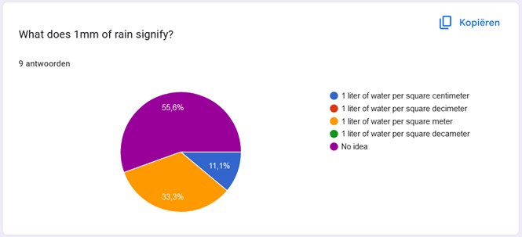
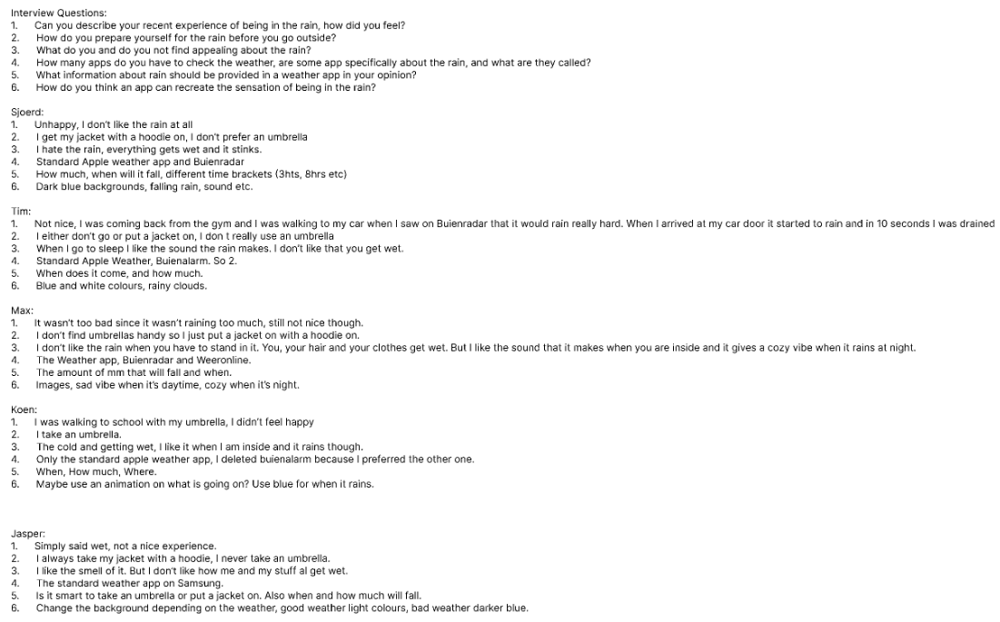
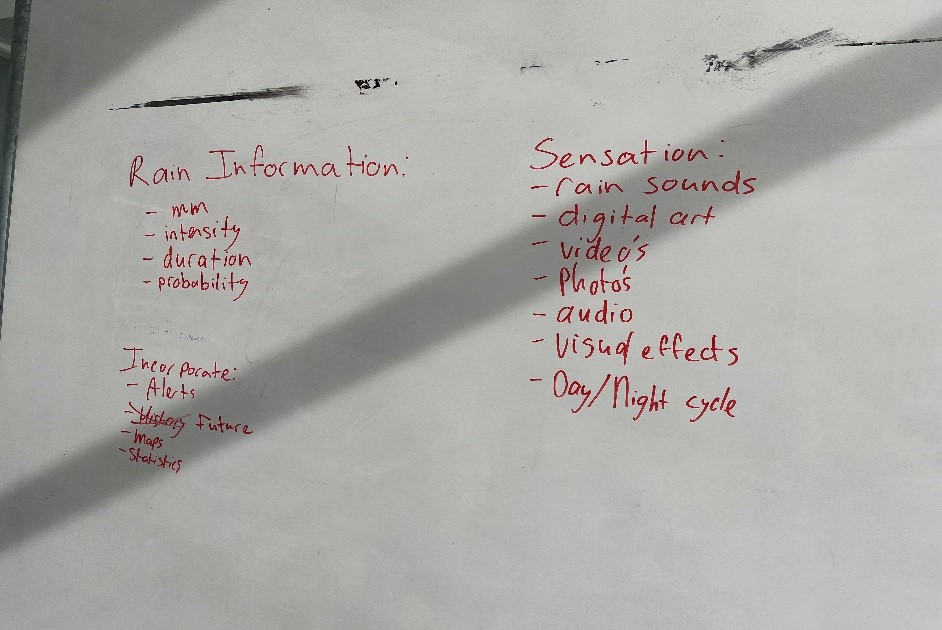
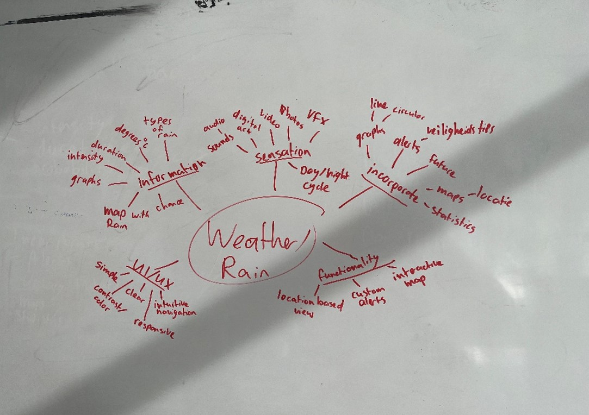
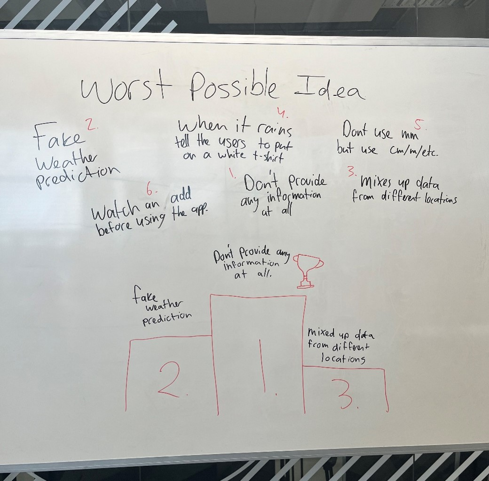
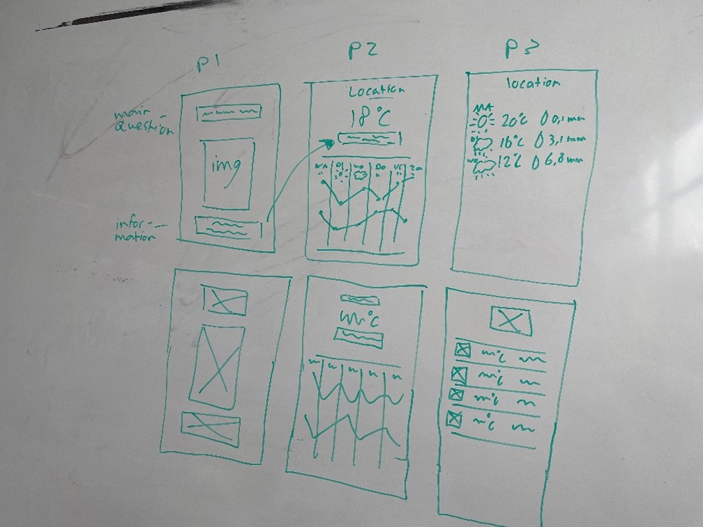
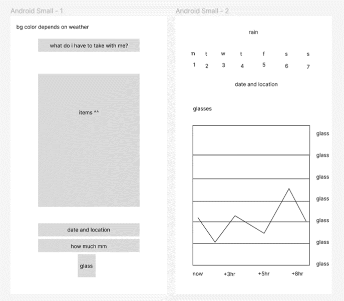
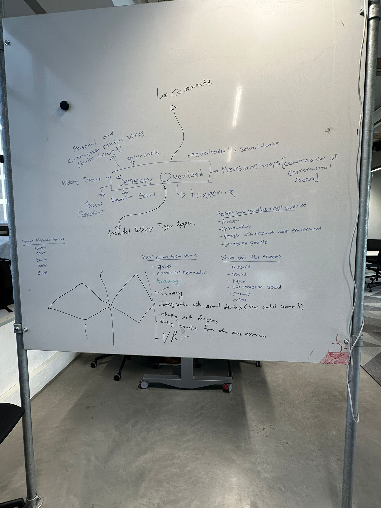

# Analysis

- [Analysis](#analysis)
  - [Week 1 - 3](#week-1---3)
    - [Research Question](#research-question)
    - [Sub-Questions](#sub-questions)
    - [Research Method 1: Stakeholder Analysis](#research-method-1-stakeholder-analysis)
    - [Research Question](#research-question-1)
    - [Sub-Questions](#sub-questions-1)
    - [Research Method 2: Brainstorming](#research-method-2-brainstorming)
    - [Research Method 3: Survey](#research-method-3-survey)
  - [Week 4 - 9](#week-4---9)
    - [Research Methods used:](#research-methods-used)
    - [Ideation Methods used:](#ideation-methods-used)
    - [Research method 1: Stakeholder analysis](#research-method-1-stakeholder-analysis-1)
      - [Sub-questions:](#sub-questions-2)
    - [Research method 2: Survey](#research-method-2-survey)
    - [Research method 3: Interviews](#research-method-3-interviews)
    - [Ideation method 1: Brainstorming](#ideation-method-1-brainstorming)
    - [Ideation method 2: Mind-mapping](#ideation-method-2-mind-mapping)
    - [Ideation method 3: Worst-Possible Idea](#ideation-method-3-worst-possible-idea)
    - [Ideation method 4: Sketching](#ideation-method-4-sketching)
    - [For whom are we making this app? Who is are our users?](#for-whom-are-we-making-this-app-who-is-are-our-users)
    - [Why would our users use our app?](#why-would-our-users-use-our-app)
    - [What is our final goal?](#what-is-our-final-goal)
  - [Week 10 - 18](#week-10---18)
    - [Brainstorming](#brainstorming)
    - [Reseach Existing Apps](#reseach-existing-apps)

## Week 1 - 3

Version: 1.0

### Research Question

How can a mobile solution help both the business as the employee to work at home more efficiently?

**Criteria:** A well-made mobile solution should improve communication, task management and secure access for businesses. Fosterign employee productivity and satisfaction. When is it done: when consistent positive impacts are validated trough feedback.

**Research Methods:**
Survey, Interviews, Stakeholder analysis and Data analytics

### Sub-Questions

1.  How can businesses measure the improvements made when implementing our mobile app for remote work, and which key performance indicators (KPI) are most relevant?

    **Criteria:** Businesses measure succes by seeing if the remote work app boosts productivity, is widely used, improves communication, speeds up tasks, reduces errors, makes employees happier, ensures secure data access, enhances collaboration, save costs and supports work-life balance.

    **Research Methods:** Surveys, Focus groups, Interviews

2.  How can a mobile solution contribute to promoting the work-life of remote workers?

    **Criteria:** A mobile solution can promote the work-life by offering schedules, easy access to work-related information, and improving communication, allowing the employees to manage their tasks and personal life more efficient.

    **Research Methods:** Observations, Interviews, Document Analysis

3.  Which security and privacy problems must we consider when making the mobile app for remote work, and how can our stakeholder's business manage this?

    **Criteria:** The mobile app should use the last security protocols for data transmission and storage to ensure privacy.

    **Research Methods:** Stakeholder Analysis, Surveys and Interviews

4.  How do mobile apps for remote working improve the workflow, and how does it impact overall productivity and experience?

    **Criteria:** The app should work seamlessly with already existing tools and software in the organization.

    **Research Methods:** Usability Testing, Analytics Analysis, Surveys

5.  How can a mobile solution help remote workers to communicate and collaborate in a better way?

    **Criteria:** The remote workers must be able to communicate effortless with the office.

    **Research Methods:** Focus Groups, Usability Testing, Interviews

---

Version: 2.0

### Research Method 1: Stakeholder Analysis

### Research Question

**Explanation:** We're asking how using mobile phones can make it easier for businesses and their employees to work from home. This comes from the growing trend of working remotely and the idea that mobile devices can help make things smoother for everyone.

How can a mobile solution help both the business as the employee to work at home more efficiently?

**Criteria:** A well-made mobile solution should improve communication, task management and secure access for businesses. Fosterign employee productivity and satisfaction. When is it done: when consistent positive impacts are validated trough feedback.

**Research Methods:**
Survey, Interviews, Stakeholder analysis and Data analytics

### Sub-Questions

1.  How can businesses measure the improvements made when implementing our mobile app for remote work, and which key performance indicators (KPI) are most relevant?

    **Criteria:** Businesses measure succes by seeing if the remote work app boosts productivity, is widely used, improves communication, speeds up tasks, reduces errors, makes employees happier, ensures secure data access, enhances collaboration, save costs and supports work-life balance.

    **Research Methods:** Surveys, Focus groups, Interviews

2.  How can a mobile solution contribute to promoting the work-life of remote workers, who miss informal conversations with their colleagues?

    **Criteria:** A mobile solution can promote the work-life by offering schedules, easy access to work-related information, and improving communication, allowing the employees to manage their tasks and personal life more efficient.

    **Research Methods:** Observations, Interviews, Document Analysis

3.  Which security and privacy problems must we consider when making the mobile app for remote work, who want informal conversations with their colleagues, and how can our stakeholder's business manage this?

    **Criteria:** The mobile app should use the last security protocols for data transmission and storage to ensure privacy.

    **Research Methods:** Stakeholder Analysis, Surveys and Interviews

4.  How do mobile apps for remote working improve the workflow, and how does it impact overall productivity and experience?

    **Criteria:** The app should work seamlessly with already existing tools and software in the organization.

    **Research Methods:** Usability Testing, Analytics Analysis, Surveys

5.  How can a mobile solution help remote workers to communicate and collaborate in a better way?

    **Criteria:** The remote workers must be able to communicate effortless with the office.

    **Research Methods:** Focus Groups, Usability Testing, Interviews

### Research Method 2: Brainstorming

We asked ChatGPT to provide us with 50 ideas on how to address issues related to remote work after Marcel suggested using ChatGPT. We arrived at the following idea:

**Coffee Table Idea:**

Target Group: Remote workers who want to replicate the coffee table and chatting experience with their colleagues from home.

Problem: When working remotely, you can't drink coffee with you colleagues and chat about the weather.

Idea: A app with a bird-eye view of a coffee table. People can join the table and communicate with eachother. You can schedule a coffee breaks, sending notifications to participants when it's time for a break.

### Research Method 3: Survey

https://forms.gle/Qp5JzPpXH2SMfDdx7

## Week 4 - 9

### Research Methods used:

-   Stakeholder Analysis
-   Survey
-   Interviews
-   Document Analysis (website)

### Ideation Methods used:

-   Mind-mapping
-   Brainstorming
-   Worst-Possible Idea
-   Sketching

### Research method 1: Stakeholder analysis

**Research Question:** How can an app tell me what it feels like to go outside in the rain?

**Explanation:** We’re asking how mobile apps can replicate the experience of being in the rain. We want to know what our stakeholders feel like when it rains and how can we use their answers to make our app.

**Criteria:** A well-made weather app should provide multiple pieces of information and should the user five at least a good understanding on how it would feel outside. When is it done: the users feel our app engaging which is validated trough feedback.

**Research Methods:** Survey, Interviews, Stakeholder analysis.

#### Sub-questions:

1. **Who are our stakeholders?**

    - **Criteria:** We shouldn’t have a too large audience, so to say that our stakeholders is everyone who want to see what weather it is outside using a weather app, will be too large. So our target group is the users of our app.
    - **Research Methods:** Survey, Interviews, User testing/ prototyping.

2. **How can our app simulate the sensation for example the rain.**

    - **Criteria:** The problem that we have is that we must make an app that provides relevant information about the rain and will give the user the sensation of that it is raining. Is it by using colours, images, sound? We will have to get to know this trough research.
    - **Research Methods:** Survey, Interviews, User testing/ prototyping, User feedback.

3. **Which pieces of information are relevant for replicating the sensation of being outside in the rain.**

    - **Criteria:** Normally, it is very important that we don’t give the user too much information. But we will have to take interviews, surveys and observe our users to get to know how much information and which should be displayed on our app. Maybe our target group wants a lot of information, or maybe they want minimal.
    - **Research Methods:** Survey, Interviews, User testing/ prototyping.

4. **How can the app engage users to interact with the simulation.**
    - **Criteria:** How can we engage our users; we will have to do research on that. Having an engaging app is important. Which UI elements do we need to consider? How can we keep our users satisfied?
    - **Research Methods:** Survey, Interviews, User testing/ prototyping, Document analysis.

### Research method 2: Survey

We really like using surveys because they are simple and effective. The good part about having a broad target group is that we have a lot of people wo can fill in our survey. Check our survey [here](https://forms.gle/brFLQAC8KRLcoKge8) and the most important results are below.

### Research method 3: Interviews

We went around a couple tables around our building to ask fellow students some questions about what they wanted to see in our app. The important questions are the last 3, I am aware that the first couple of questions could’ve been left out.

### Ideation method 1: Brainstorming

Marcel’s suggestion to use ChatGPT for brainstorming was a real help. Thinking about 50 ideas takes some time which can be spend much effectively. We used AI for inspiration and brainstormed a little. We used these ideas for our mind map as well.

### Ideation method 2: Mind-mapping

The second ideation method that we used was mind mapping. Our main categories were UI/UX, functionality, information, sensation, and incorporation.

### Ideation method 3: Worst-Possible Idea

### Ideation method 4: Sketching

I did some sketching to also ideate some more. We looked at which pieces of data our users want to see, and which should have priority. I also made a quick wireframe in Figma so that it was more clear.

### For whom are we making this app? Who is are our users?

For some users it is more important what they need to bring with them and how much it will rain. Someone who is walking needs an raincoat more than someone who is driving in his car. However, they both should take a raincoat. It is also still important information if it is raining for the both of them. Because of this our target group is large.
The users are mostly people who go by foot or by bike who want to know “How wet they will get” going from their current location to another. Off course, it could still be valuable for people who go by car or bus, depending on the scenario. Our users must have a phone to use our app, so the age range goes from about 16-65+. The range of when our app is most accurate depends on where you want to use it for, if you’re A to B is around the corner it isn’t as accurate if it is around 10km. But going further than 30-40km it also isn’t as accurate.

### Why would our users use our app?

Let’s set up a scenario, picture a student who travels with public transport wants to go from s-Hertogenbosch to the TQ. We looks outside and the sun is shining, so he goes outside without a jacket. When he arrives in Eindhoven it starts raining and he gets drenched. He would use our app to know if he would get wet traveling from his home to the TQ. Our users would use our app to prevent getting wet and be prepared for rain for their trip.

A whole different scenario would be if I want to go from my home to the supermarket which is 10 minutes by bike. I open my app, see that I will get wet and should take a raincoat with me. I could choose to wait because of this or go anyway.

In both scenarios our users are way different since one is more exposed to the rain than the other, but they still would have used our app.

### What is our final goal?

Our final goal is that people are actually using our app and it has an actual purpose for them. We want our users to fill in where they want to go, if it is raining on the way they will take an umbrella or raincoat, or they will wait until the rain has passed. We want our users to be prepared for the rain that will fall during their trip.

## Week 10 - 18

### Brainstorming

We started with a brainstorming session to get know what sensory overload is and how we can prevent it. We came up with the following ideas:

### Reseach Existing Apps

I looked at some existing apps to see how they are dealing with the problem of sensory overload. We looked at the apps from Headspace, Calm and Endel. You can find the research [here](https://github.com/jraemakers/industry-project-krom2/blob/main/Research/Existing-apps.md).
