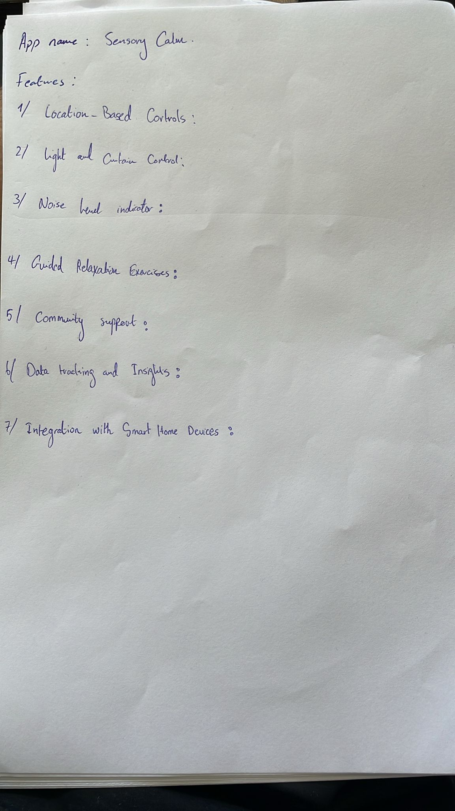
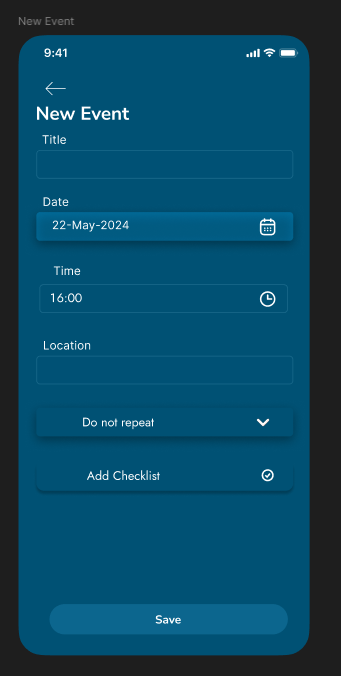

# Design

- [Design](#design)
  - [Week 1 - 3](#week-1---3)
    - [First Design](#first-design)
    - [Feedback](#feedback)
    - [Final Design](#final-design)
  - [Week 4 - 9](#week-4---9)
    - [User Testing](#user-testing)
    - [Which view does our users like the best?](#which-view-does-our-users-like-the-best)
  - [Week 10 - 15](#week-10---15)
    - [Paper sketches](#paper-sketches)
    - [Figma Design](#figma-design)
  - [Week 16 - 18](#week-16---18)
    - [First sketch](#first-sketch)
    - [Multiple sketches](#multiple-sketches)
      - [User feedback](#user-feedback)

## Week 1 - 3

### First Design

We started with the following design:

### Feedback

After the first designes, we asked for feedback and tried to improve the design based on the feedback we got. We got the following feedback:

### Final Design

If you want to see the prototype in action, click [here](https://www.figma.com/file/crZXBvnwvBReC5GO1RuGAu/Justin's-Prototype-Remote-Working).

## Week 4 - 9

In our figma you can see the design process we went through. We started with a simple design and iterated on that design. We asked for feedback and improved the design based on the feedback we got. We also did some user testing to see if the design was user friendly. You can see our figma [here](https://www.figma.com/file/Te79kCJxemQHlWli2oAud8/WEATHER-APP).

### User Testing

**Introduction:**
I started with a brief introduction about the goal of the user test and gave an explanation about our project to the users.

**Goals:**
The goals of this user test is that we get to know if our app is useful for our users. We want our users to change their behaviour depending on the outcome of our app and be better prepared for their trip.

**Scenario and test:**
The first user got this scenario. “You are at home and you want to go to school by bike.” He filled in the text field and put the city where his school was located. It gave him a rainy cloud together with a raincoat. I asked him, what does this mean and what will you do? He said that it meant that it will rain from his home to school and that he will take a raincoat with him and go by car instead of by bike.

The second user got the scenario. “You are at home and you want to go to your girlfriend.” He also filled in the text field with the location of his girlfriend’s home and it gave him a normal cloud and a green check mark. I asked him what does it mean and what do you do with this information. He said that it won’t rain on the way and that he won’t take anything like an umbrella of raincoat with him. He however will put on his winter jacket and a hoodie because it is only 10 degrees outside.

**Test execution and result:**
The two users went trough the test very quick and easy. They immediately filled in the text field of their destination, got information, knew what it meant and changed their plan based on this. The test was a success, and this gives us the green light to start coding the real thing.

### Which view does our users like the best?

| Name   | Answer |
| ------ | ------ |
| Koen   | A      |
| Sjoerd | B      |
| Jarno  | A      |
| Joris  | A      |
| Jasper | A      |
| Paul   | A      |
| Steven | A      |
| Jens   | B      |
| Tim    | A      |

**Explanation:**

We got feedback from Erik about our starting view. Previously we had D, but after asking our users and target group about which starting view, they liked the best we concluded that our users found view A the cleanest, clear, and overall, the best out of the 4.

## Week 10 - 15

### Paper sketches

After the brainstorming session we started with paper sketches. Every team member made a paper sketch of the idea they liked the most. We discussed the sketches and combined the best parts of every sketch to make a plan for the final design. The first sketch is the one I made.

### Figma Design

After the paper sketches we started with the design in Figma. We made a design that was based on the paper sketches. We asked for feedback and iterated on the design. The final design can be seen in the figma link below. With every iteration we have some notes about what we changed and why we changed it. You can see our figma [here](https://www.figma.com/design/MxIjcpuEGOVHNoTNXMyNQW/OFF?node-id=0-1&t=XwOaBzEWRCdIxRRx-1).

I made the diary page and new event page see images below.

## Week 16 - 18

### First sketch

I started with a first sketch of the app.

### Multiple sketches

After advice from Erik, I made multiple sketches of the app.

    
    
    

-   **Sketch 1:** In the first sketch there is a list of all the events with information about the event and you can scroll vertically through the list.

-   **Sketch 2:** Sketch 2 is the same as 1 but you can scroll horizontally through the list.

-   **Sketch 3:** In sketch 3 you can see the details of an event when you click on it in the list and it will expand to show more information.

-   **Sketch 4:** In sketch 4 you can swipe left and right to see the different events.

#### User feedback

**Joris**

Joris didn't like sketch 2 because scrolling horizontally is not user friendly. He liked the most sketch 3 because you can see more information about an event when you click on it. He tough sketch 4 wasn't user friendly because you have to swipe left and right to see the different events.

**Justin**

Justin is afraid that you have to scroll a lot in sketch 1. He doesn't like sketch 2 because scrolling horizontally. He liked sketch 3 the most. He tough sketch 4 was okay but not the best because you have to swipe left and right to see the different events.
