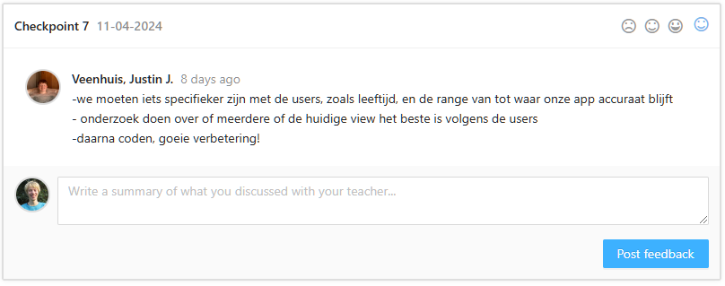
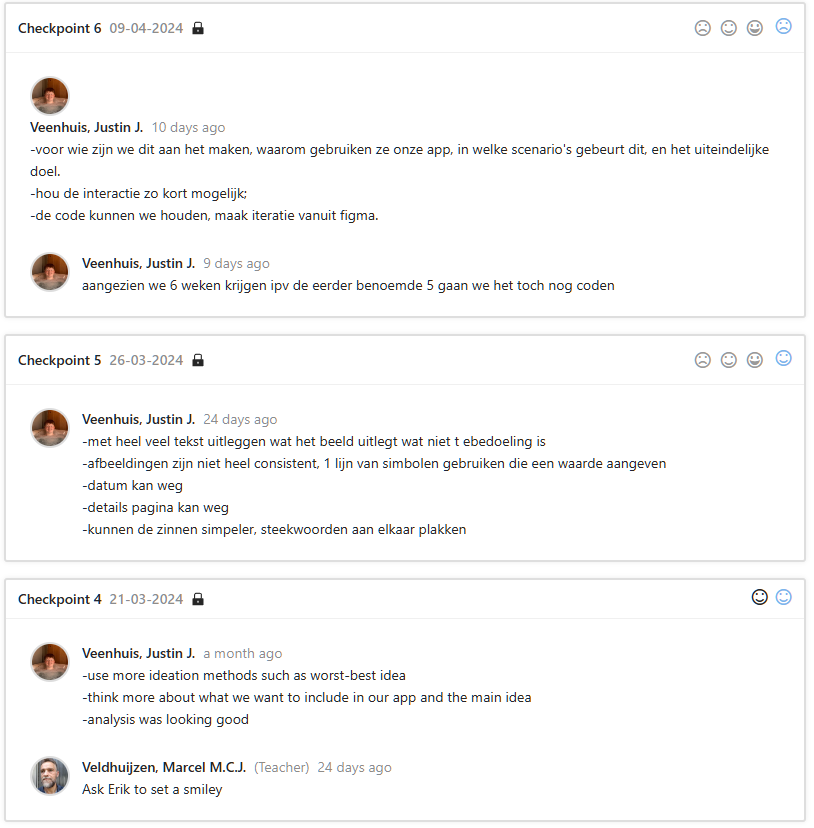
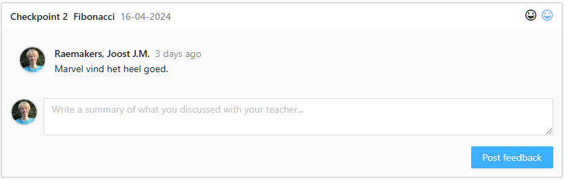

# Management & Control

-   [Management \& Control](#management--control)
    -   [Week 1 -3](#week-1--3)
        -   [Feedback duo case](#feedback-duo-case)
        -   [Feedback tech case](#feedback-tech-case)
    -   [Week 4 - 9](#week-4---9)
        -   [Feedback duo case](#feedback-duo-case-1)
        -   [Feedback tech case](#feedback-tech-case-1)

## Week 1 -3

I have asked for feedback on my development process to assure the quality in direct communication with all stakeholders. I have processed the feedback given in my work. I also asked for feedback future developers to hear their opinion about my work.

### Feedback duo case

### Feedback tech case

## Week 4 - 9

### Feedback duo case

### Feedback tech case

