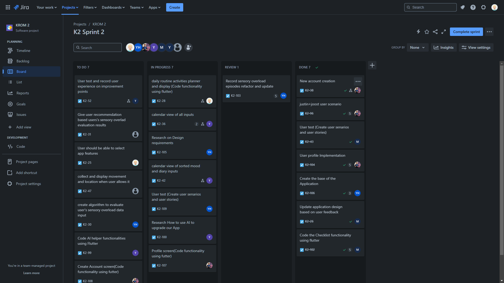

- [Professional Skills](#professional-skills)
  - [Scrum](#scrum)
    - [Scrum board](#scrum-board)
    - [Retrospective](#retrospective)

# Professional Skills

I hope to show you my professional development as a mobile developer in the form of this portfolio. I will show you my work and what I have learned. I will also show you how I have achieved the learning outcomes and how I have improved my skills. This portfolio will be a showcase of my professional development as a mobile developer. Stay tuned for more updates.

## Scrum

We used Scrum to keep track of our progress. We had a daily stand-up meeting to discuss what we had done, what we were going to do and if we had any problems. We also had a sprint review meeting to discuss what we had done and what we were going to do next. We also had a sprint retrospective meeting to discuss what went well and what could be improved. This is helpful to improve our process and our work.

### Scrum board

We used Jira to keep track of our progress. So we could see what we had done, what we were going to do and if we had any problems. I helped to set up the Scrum board.

### Retrospective

In the retrospective we discussed what went well and what could be improved. We also discussed what we could do to improve the things that could be improved. So we could improve our process and our work for the next sprint.

