# Realisation

-   [Realisation](#realisation)
    -   [Week 1 - 3](#week-1---3)
        -   [Tech Case 9: A battery app for a global audience](#tech-case-9-a-battery-app-for-a-global-audience)
        -   [Duo Case 5: Efficient remote working](#duo-case-5-efficient-remote-working)
    -   [week 4 - 9](#week-4---9)
        -   [Tech Case 18: Pizza Fibonacci Creator](#tech-case-18-pizza-fibonacci-creator)
        -   [Duo Case 7: Rain Radar](#duo-case-7-rain-radar)
    -   [Week 10 - 18](#week-10---18)
        -   [Industry Project: Krom 2](#industry-project-krom-2)

## Week 1 - 3

### Tech Case 9: A battery app for a global audience

As you can see the app is available in multiple languages. When Arabic is selected everything is mirrored. You can see the battery percentage using a progress bar. In the progress bar, multiple colors are used to show the battery percentage. You can find how long the battery will last and how long it will take to charge.

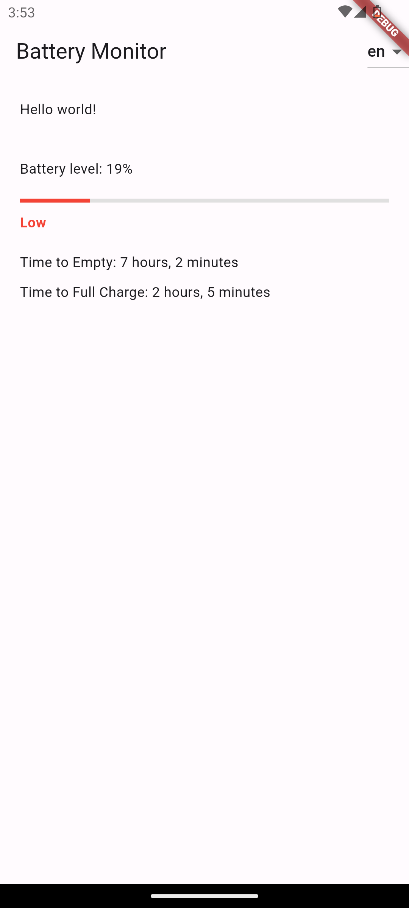
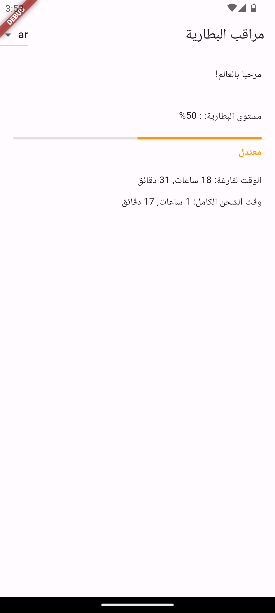
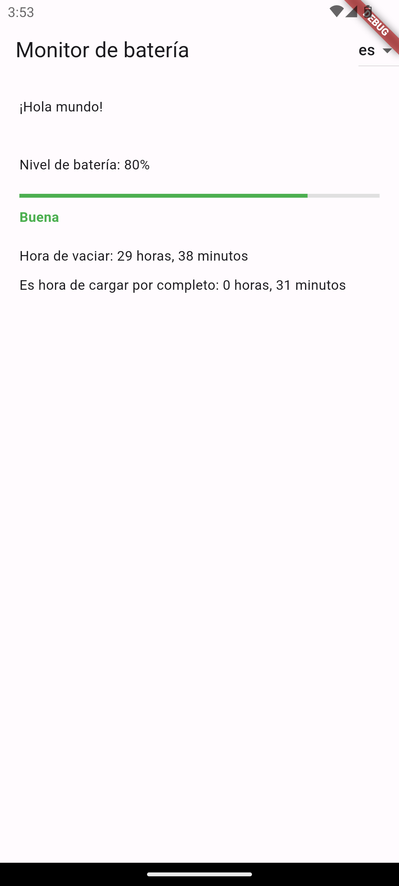

### Duo Case 5: Efficient remote working

When developing this app we tried to stick to the design as much as possible. We used widget to make the code more readable when needed. We also could have made the mood switcher more user friendly by making it more obvious that the user can slide it.

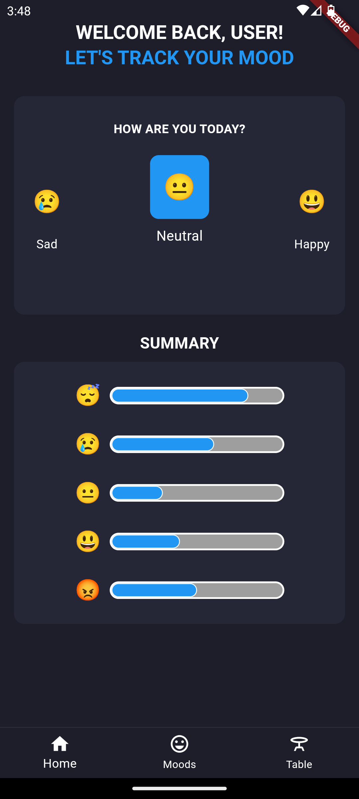
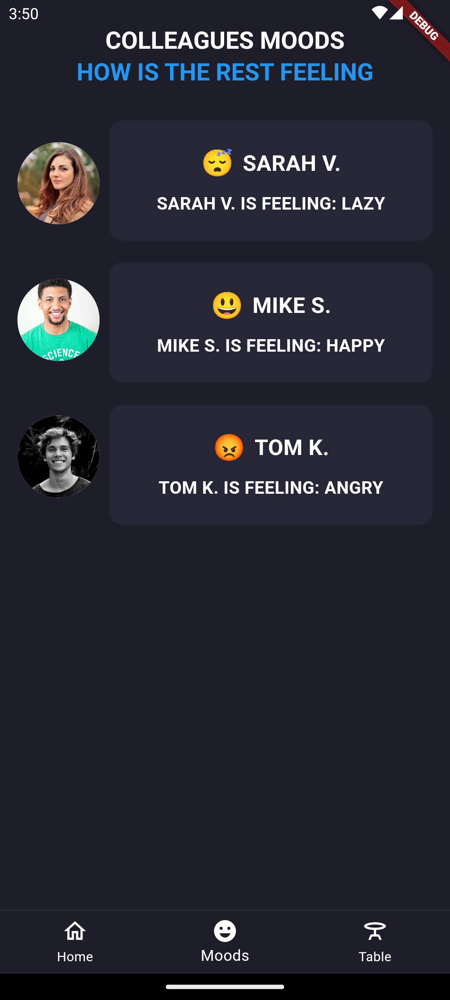
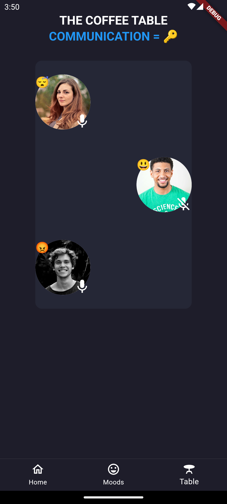

## week 4 - 9

### Tech Case 18: Pizza Fibonacci Creator

This app is a pizza creator. You can choose the ingredients you want on your pizza. You can change the amount of ingredients by dragging the up or down based on the Fibonacci sequence. When you create the pizza you van see the pizza with the ingredients you have chosen and the amount of ingredients you have chosen. Underneath the pizza, fibonacci numbers with the coreesponding ingredients are shown.

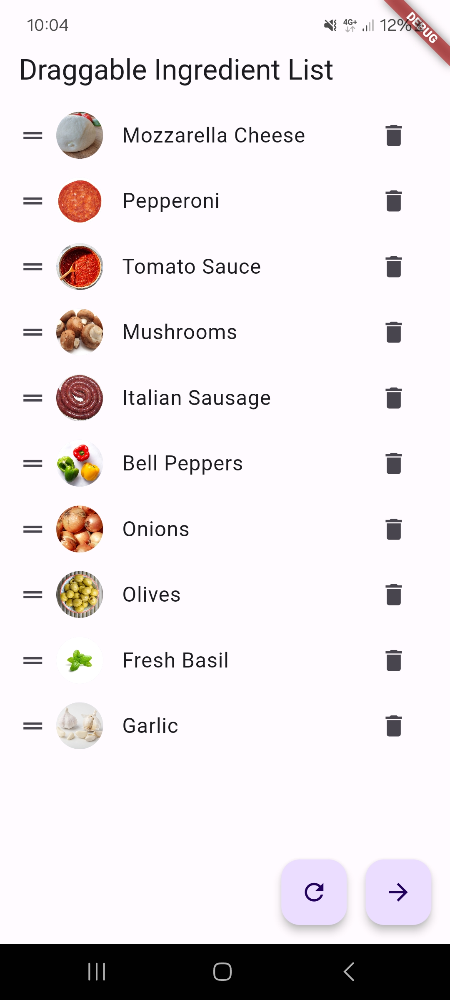
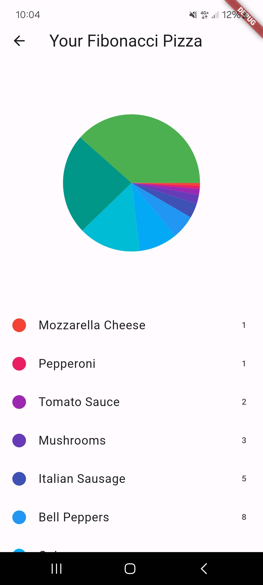

### Duo Case 7: Rain Radar

In this app you can enter the location where you want to go and it will tell you what piece of clothing you need for the rain. It also shows the temperature. So you can make better decisions about what to wear and you dont have to be cold or wet. This make use of the OpenWeatherMap API.

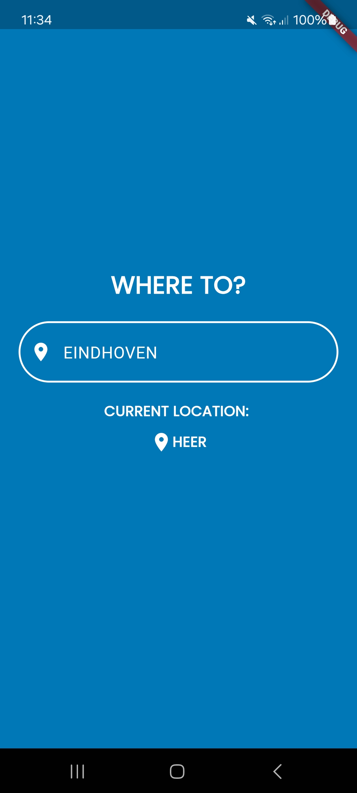
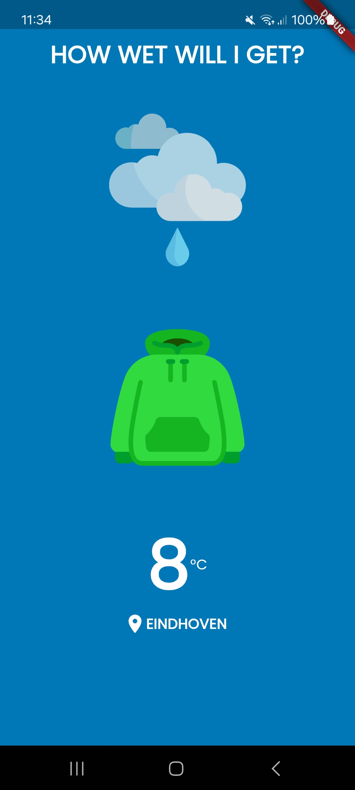

## Week 10 - 18

### Industry Project: Krom 2

We made an app to help people with coping with sensory overload. In the app you can make a planning so won't get surprised by things. And there is a diary where you can write down what you have done and how you felt. I personally made the page where you can create a new event. See the video below for a demonstration.

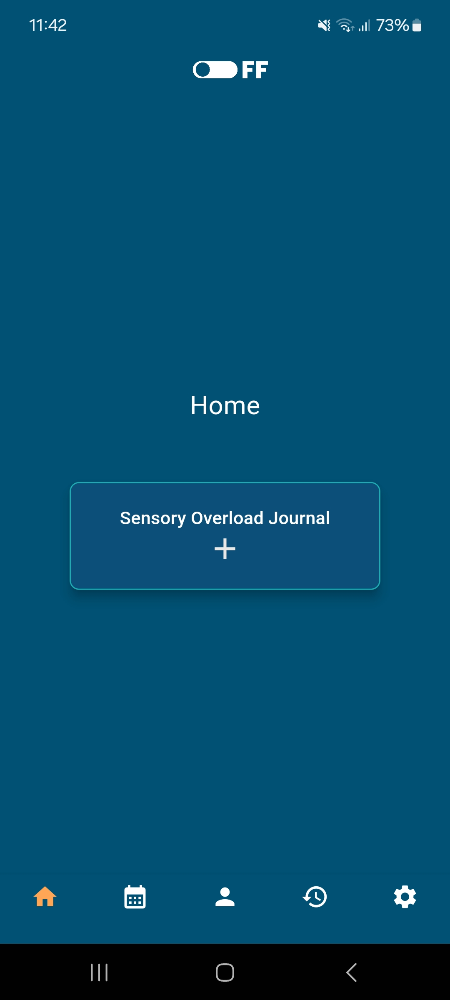
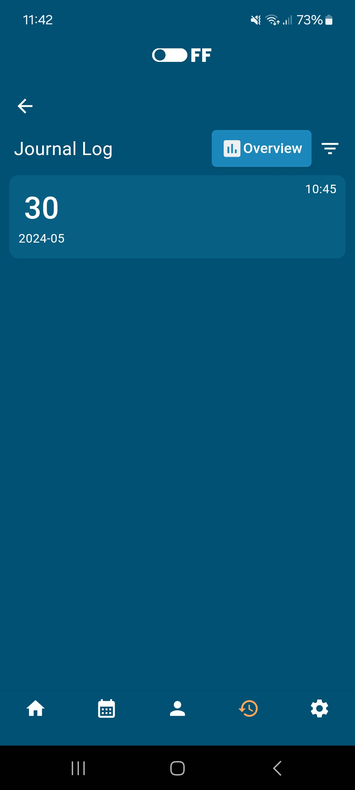
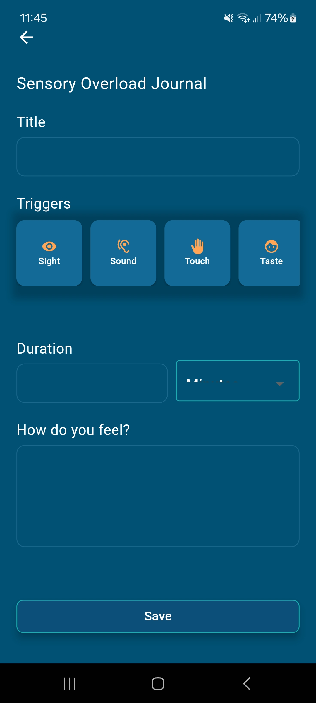
<video width="300"  controls>
  <source src="../Images/Screen_Recording_20240531_112613.mp4" type="video/mp4">
</video>
