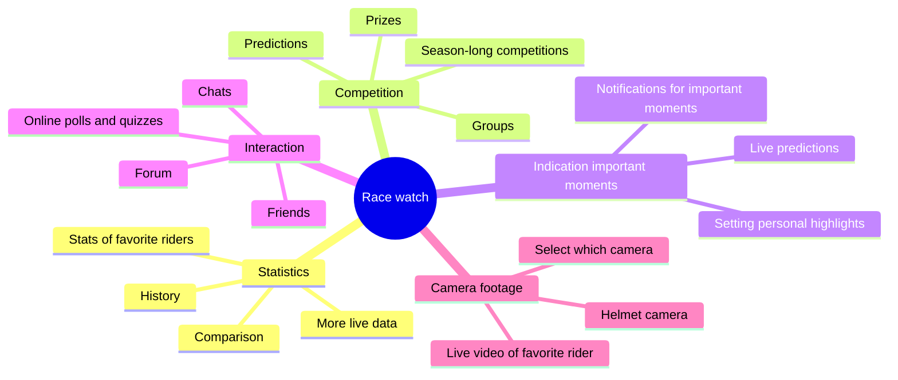

# Analysis

-   [Analysis](#analysis)
    -   [Problem definition](#problem-definition)
    -   [Main research question](#main-research-question)
    -   [Sub-questions](#sub-questions)
    -   [Brainstrom](#brainstrom)
        -   [Brainwriting](#brainwriting)
        -   [Mind mapping](#mind-mapping)
    -   [Available product analysis](#available-product-analysis)
        -   [Tour de France and La Vuelta](#tour-de-france-and-la-vuelta)
        -   [Giro d'Italia](#giro-ditalia)
        -   [Tour Tracker](#tour-tracker)
    -   [Explore user requirements](#explore-user-requirements)
        -   [Scenario](#scenario)
        -   [Persona 1](#persona-1)
        -   [Persona 2](#persona-2)
        -   [Persona 3](#persona-3)
    -   [Sources](#sources)

## Problem definition

Pro cycling races are exciting events that are enjoyed by many fans around the world. However, it can be difficult for fans to keep track of all the action and stay engaged throughout the entire race. How can we create a mobile app that enhances the experience of watching a pro cycling race and provides fans with a comprehensive resource for following the action?

## Main research question

How can a mobile app effectively enhance the experience of watching a pro cycling race and provide fans with a comprehensive resource for following the action, while also creating a fun and engaging experience?

## Sub-questions

-   What types of features and resources would be most valuable for pro cycling fans, such as live race updates, rider stats, and course maps?
-   How can we create a personalized experience for users that takes into account their individual interests and preferences?
-   How can we incentivize users to engage with the app and continue using it?

## Brainstrom

### Brainwriting

-   More data from the riders during the race
    -   Only data from favorite riders
-   Interaction with other cycling fans
-   More live footage (camera on the bike)
-   An app that indicates when it's getting exciting
-   Create competition through predictions

### Mind mapping

## Available product analysis

### Tour de France and La Vuelta

These two apps are very similar in terms of functionality and design. One of them is the official app for the Tour de France, and the other is the official app for La Vuelta. The only difference between the two apps is the color scheme and the logo. When you open the app, you are greeted with a splash screen after that there is advertising for skoda. That is really annoying because you have to wait for the ad to finish before you can access the app. After the ad, you are taken to the home screen of the app. They have a bottom navigation bar with five tabs: Home, rankings, live, videos and menu. The home tab shows the latest news and updates about the Tour de France or La Vuelta. The rankings tab shows the current standings of the riders in the race. You can filter the rankings by different categories such as general classification, points classification, mountain classification and young rider classification. You can also see the rankings of the teams and individual stages. The live tab shows live updates and commentary during the race. The videos tab shows highlights and interviews. The menu tab has links to other sections of the app such as the schedule, route, teams, riders, etc. About every stage is little information about the start en finish location. Overall, the apps are well designed and easy to use and provide a good user experience for fans of the Tour de France and La Vuelta.

    
    
    
    

### Giro d'Italia

At the homescreen of the Giro d'Italia app, you can see the different stages and news about the tour. The app has a bottom navigation bar with five tabs: Home, The route, Live, Leaderboard and Teams. The Route tab shows the route of the Giro d'Italia. You can see the start and finish locations of each stage and the distance and elevation of the stage. The Live tab shows live updates and commentary during the race. The Leaderboard tab shows the current overal standings and stage results. You can filter the leaderboard by different categories such as general classification, points classification, mountain classification and young rider classification. The Teams tab shows information about the teams and riders that are participating in the Giro d'Italia. The app is well designed and easy to use and provides a good user experience for fans of the Giro d'Italia.

    
    
    
    

### Tour Tracker

The Tour Tracker app has very much information about all the cycling races. It isn't very clear how to switch between the different races. The app has many tabs and it isn't very clear what each tab does. I think the app is a bit overwhelming for new users. The app has a lot of information that the user has to scroll through to find what they are looking for. It shows information about the rankings, stages, riders, news and live updates. Overall, the app has to much information in my opinion and it isn't very user friendly.

## Explore user requirements

### Scenario

You want to watch the Tour de France stage live, but you are not able to watch the start of the stage. You start watching the stage on TV, but you want to know what happened at the start of the stage. So you want a solution that helps you catch up on the action that you missed.

### Persona 1

-   **Name**: John
-   **Age**: 35
-   **Occupation**: Software developer
-   **Location**: Amsterdam
-   **Interests**: Cycling, technology, sports
-   **Goals**: Stay up to date with the latest cycling news and follow his favorite riders
-   **Story**: John is a big fan of pro cycling and enjoys watching live races. However, due to his busy schedule, he sometimes misses the start of the Tour de France stages.

### Persona 2

-   **Name**: Sarah
-   **Age**: 25
-   **Occupation**: Marketing manager
-   **Location**: London
-   **Interests**: Cycling, social media, travel
-   **Goals**: Stay informed about the latest cycling events, connect with other cycling fans, and share her passion for the sport on social media
-   **Story**: Sarah is a casual cycling fan who wants to stay up to date with the latest news and events. She often misses the start of the Tour de France stages due to her social and travel activities.

### Persona 3

-   **Name**: Alex
-   **Age**: 45
-   **Occupation**: Teacher
-   **Location**: New York
-   **Interests**: Cycling, history, travel
-   **Goals**: Learn more about the history of pro cycling, follow his favorite riders, and engage with other fans
-   **Story**: Alex is a cycling enthusiast who wants to deepen his knowledge of the sport and connect with other fans. His teaching schedule sometimes prevents him from watching the start of the Tour de France stages live, so he relies on updates and highlights.

## Sources

-   [ICT Research Methods](https://ictresearchmethods.nl)
-   [Lucidchart](https://www.lucidchart.com/blog/effective-brainstorming-techniques)
