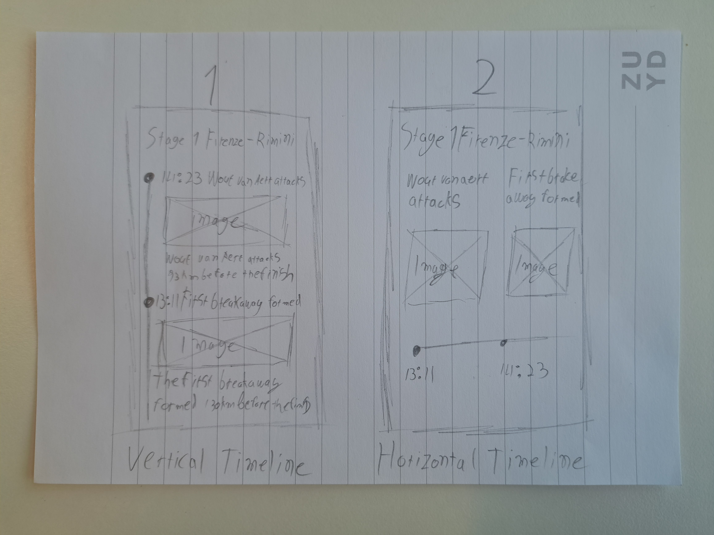
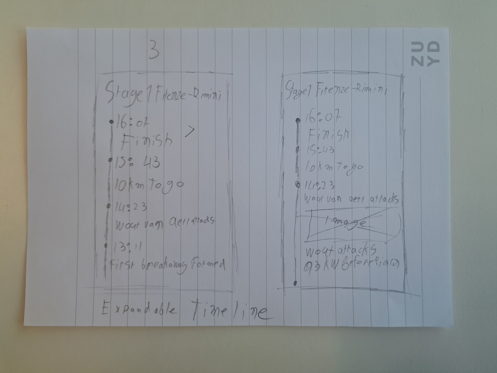
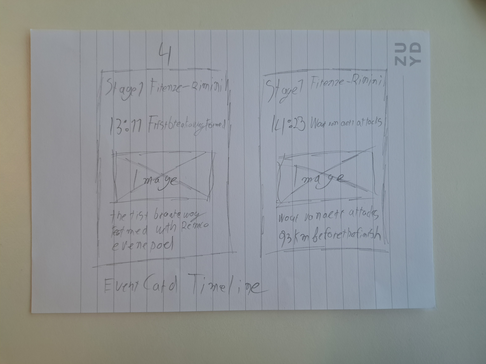

# Design

-   [Design](#design)
    -   [First sketch](#first-sketch)
    -   [Multiple sketches](#multiple-sketches)
        -   [User feedback](#user-feedback)

## First sketch

I started with a first sketch of the app.

## Multiple sketches

After advice from Erik, I made multiple sketches of the app.

    
    
    

-   **Sketch 1:** In the first sketch there is a list of all the events with information about the event and you can scroll vertically through the list.

-   **Sketch 2:** Sketch 2 is the same as 1 but you can scroll horizontally through the list.

-   **Sketch 3:** In sketch 3 you can see the details of an event when you click on it in the list and it will expand to show more information.

-   **Sketch 4:** In sketch 4 you can swipe left and right to see the different events.

### User feedback

**Joris**

Joris didn't like sketch 2 because scrolling horizontally is not user friendly. He liked the most sketch 3 because you can see more information about an event when you click on it. He tough sketch 4 wasn't user friendly because you have to swipe left and right to see the different events.

**Justin**

Justin is afraid that you have to scroll a lot in sketch 1. He doesn't like sketch 2 because scrolling horizontally. He liked sketch 3 the most. He tough sketch 4 was okay but not the best because you have to swipe left and right to see the different events.
