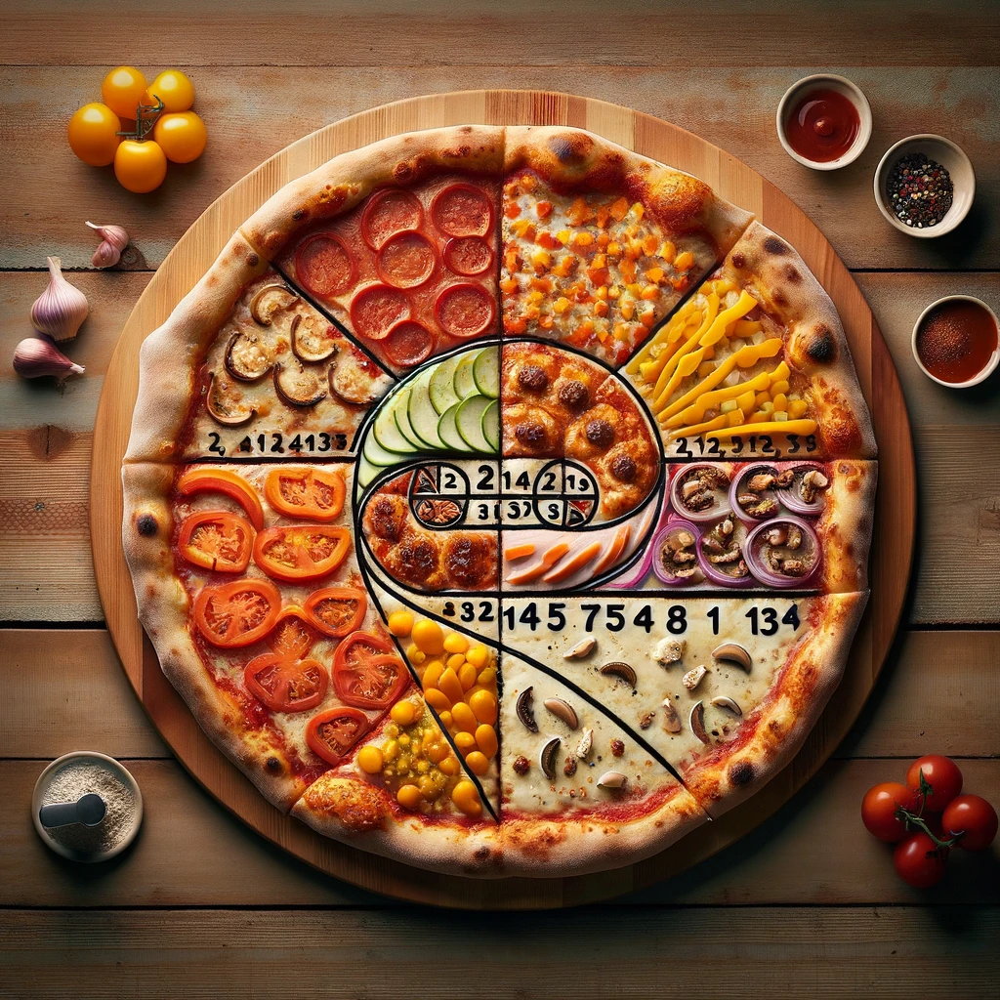

# Tech Case 18: Pizza Fibonacci Creator

Create an app whereby the user can make his own pizza Fibonacci.

The app has at least two screens.

Screen 1: a list of ingredients (with a picture/foto and some explanatory text) that the user can pick.

Screen 2: a picture of the completed pizza with a list of all ingredients and the amount (number) of every ingredient needed.

A pizza Fibonacci has 1 piece of ingredient X, 1 piece of ingedient Y, 2 pieces of ingredients Z, etc. etc.

See: https://en.wikipedia.org/wiki/Fibonacci_sequence

