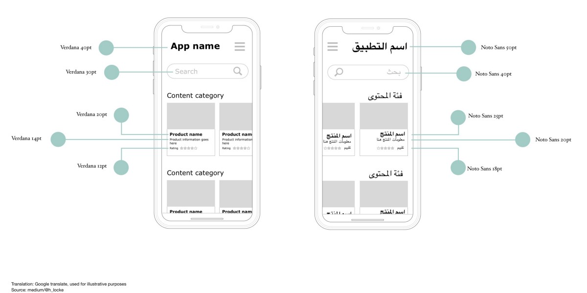

# Tech Case 9: A battery app for a global audience

Create an app that shows the following parameters to the user:

-   The percentage of charge of the battery of the device from 0% (empty battery) to 100% (fully charged).
-   A graph, progress bar or other visualisation of the current charge of the battery with colours red, green and orange to represent different percentages.
-   When your phone is charging: the number of minutes it takes to charge the battery.
-   When your phone is not charging: the number of minutes left for the battery to be empty.
-   The app must be for a global audience: The app can switch between a few languages and make sure that the UI adapts to the user's selection. One of the language that can be selected should be a right-to-left language like Arabic or Hebrew.

